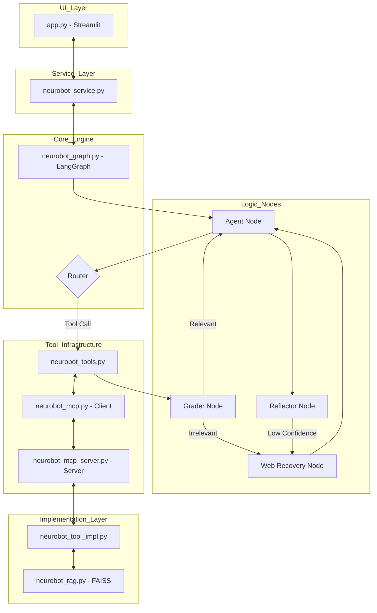

# 🤖 NeuroBot-Conversational-AI: Project Deep-Dive & Architecture

This document provides an elite-level technical breakdown of the NeuroBot repository. It covers the architectural theory, file-level implementation details, and interview preparation.

---

## 🏗️ 1. Project Theory & Architecture

NeuroBot is a **Production-Grade Agentic RAG (Retrieval-Augmented Generation)** system. Unlike simple RAG pipelines that follow a linear path (Query -> Retrieve -> Generate), NeuroBot uses an **Agentic Loop** powered by **LangGraph**.

### Core Technical Pillars:
1.  **Agentic Brain (LangGraph)**: Uses a state machine to decide whether to answer directly, retrieve documents, or search the web based on confidence.
2.  **Corrective RAG (CRAG)**: Implements a "Grader" node that evaluates the relevance of retrieved documents. If the context is irrelevant, it automatically triggers a web search recovery.
3.  **MCP (Model Context Protocol)**: Uses a decoupled server-client architecture for tools, making the system highly modular and scalable.
4.  **Structured Output**: Forces the LLM to provide confidence scores and citations using Pydantic schemas.
5.  **Multi-Tenant Checkpointing**: Conversation states are persisted in SQLite, allowing for multi-user/multi-session management.

---

## 📁 2. File-by-File Technical Breakdown

### `app.py`
*   **Purpose**: The entry point. A Streamlit-based premium dashboard for user interaction.
*   **Key Variables**:
    *   `st.session_state.conversations`: Dictionary storing chat history and quality reports.
    *   `settings`: Instance of global application settings.
*   **Key Functions**:
    *   `create_chat_session()`: Initializes a new UUID-based thread.
    *   `st.chat_input()`: Captures user prompts and triggers the LangGraph loop.
*   **Connections**: Calls `src.neurobot_service` to get the "Brain" and `src.neurobot_rag` for ingestion.

### `src/neurobot_graph.py` (The Heart)
*   **Purpose**: Defines the LangGraph state machine and node logic.
*   **Key Functions**:
    *   `agent_node()`: The main LLM logic. Binds tools and handles structured output.
    *   `grader_node()`: Evaluates document relevance (CRAG logic).
    *   `reflector_node()`: Self-correction node that checks confidence.
    *   `compile_brain()`: Assembles the nodes and edges into a functional graph.
*   **Connections**: Connects `neurobot_tools`, `neurobot_db`, and `neurobot_eval`.

### `src/neurobot_mcp.py`
*   **Purpose**: A custom client for the Model Context Protocol. Handles communication with tool servers over stdio.
*   **Key Functions**:
    *   `McpClient.call_tool()`: Sends JSON-RPC requests to a tool server and parses line-delimited JSON responses.
    *   `_parse_server_config()`: Configures how tool servers are launched.
*   **Connections**: Used by `src/neurobot_tools.py`.

### `src/neurobot_rag.py`
*   **Purpose**: Handles PDF processing and Vector Search using FAISS.
*   **Key Functions**:
    *   `ingest_pdf()`: Chunks documents and creates a local FAISS index.
    *   `get_retriever()`: Loads a persisted vector store for a specific thread.
*   **Connections**: Uses `HuggingFaceEmbeddings` and `FAISS`.

### `src/neurobot_eval.py`
*   **Purpose**: Automated response auditing using the **RAGAS** framework.
*   **Key Functions**:
    *   `run_evaluation()`: Measures **Faithfulness** (no hallucinations) and **Answer Relevancy**.
*   **Connections**: Integrated into the `agent_node` for real-time quality checking.

---

## 📊 3. System Architecture Graph

---

## 💡 4. Potential Interview Questions

### Q1: Why did you choose LangGraph over a simple LangChain chain?
**Answer**: A simple chain is linear. NeuroBot requires a **cyclic** workflow where the agent can "reflect" on its answer or "re-try" a search if the first result was poor. LangGraph allows for state management, persistence (checkpointing), and complex conditional routing that linear chains cannot handle.

### Q2: What is "Corrective RAG" (CRAG) and how is it implemented here?
**Answer**: CRAG is a pattern where we don't just trust the retriever. In `neurobot_graph.py`, the `grader_node` acting as a quality gate. It asks the LLM to verify if the retrieved documents actually match the user's question. If the grade is "No", we bypass the broken context and trigger a Web Search (DuckDuckGo) to recover.

### Q3: How do you handle "Hallucinations" in this project?
**Answer**: We use a dual-layer approach:
1.  **Groundedness Audit**: The `neurobot_eval` module uses **RAGAS** to compute a "Faithfulness" score, checking if every claim in the answer exists in the retrieved context.
2.  **System Prompting**: The agent is strictly instructed to cite sources and express uncertainty if the retrieved evidence is insufficient.

### Q4: Explain the MCP architecture you used.
**Answer**: MCP (Model Context Protocol) decouples the tools from the agent. The `McpClient` starts a separate process for the `McpServer`. They communicate via JSON-RPC. This is "Interview Ready" because it demonstrates knowledge of scalable, distributed AI architectures where tools can reside on different servers.

### Q5: How do you handle multi-user sessions?
**Answer**: We use **Thread-level Isolation**. Each conversation has a unique UUID. The FAISS vector stores and the SQLite checkpointer use this UUID to ensure that User A cannot see User B's documents or chat history.

---

*Generated by NeuroBot Documentation Engine*
