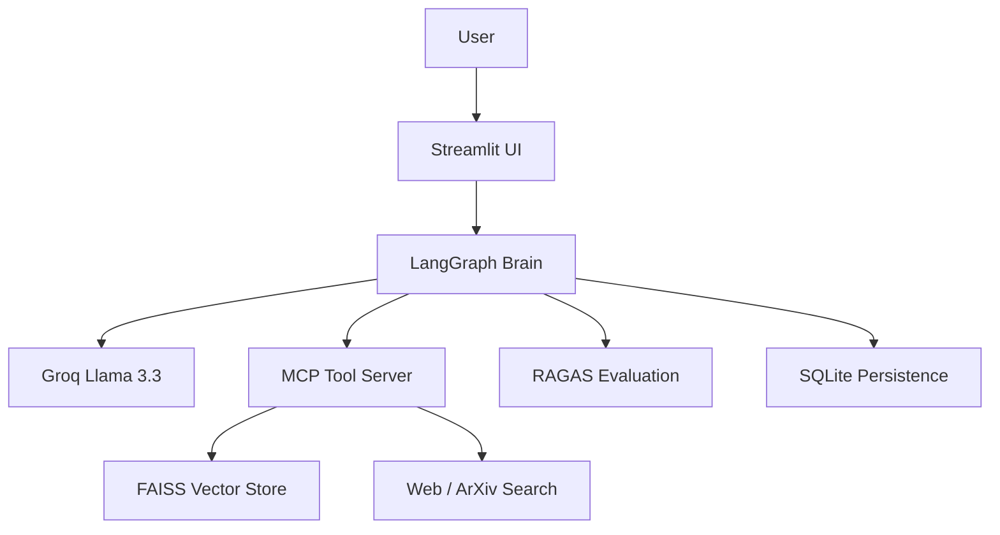

# 🤖 NeuroBot: Agentic RAG Research Assistant

NeuroBot is a production-grade conversational AI system designed for deep technical document analysis and research. It utilizes **LangGraph** for sophisticated multi-step orchestration and the **Model Context Protocol (MCP)** for a modular, scalable tool architecture.

## 🚀 Core Features

- **Agentic Orchestration**: Uses LangGraph to implement Corrective RAG (CRAG) and self-correction loops.
- **Intelligent Retrieval**: Combines local PDF indexing (FAISS) with real-time ArXiv and DuckDuckGo web search recovery.
- **Automated Quality Audit**: Integrated RAGAS evaluation to measure Faithfulness and Answer Relevancy in real-time.
- **Session Persistence**: Robust multi-tenant session management using SQLite checkpointing.
- **Modular Tooling**: Fully decoupled tool execution via local and remote MCP servers.

## 🛠️ Technology Stack

- **Brain**: LangGraph, LangChain
- **LLM**: Groq (Llama 3.3 70B)
- **Vector Search**: FAISS
- **Embeddings**: HuggingFace (all-MiniLM-L6-v2)
- **Interface**: Streamlit (Dashboard), FastAPI (REST API)
- **Persistence**: SQLite

## 📂 Project Structure

```text
├── api/                # FastAPI Backend
├── src/                # Core Logic
│   ├── neurobot_graph.py   # LangGraph Workflow
│   ├── neurobot_rag.py     # Vector Search & Ingestion
│   ├── neurobot_mcp.py     # MCP Client Implementation
│   └── neurobot_eval.py    # RAGAS Quality Auditing
├── scripts/            # Utility & Benchmark Scripts
├── app.py              # Streamlit Dashboard
└── requirements.txt    # Project Dependencies
```

## 🚥 Quick Start

1. **Install Dependencies**:
   ```bash
   pip install -r requirements.txt
   ```

2. **Configure Environment**:
   Create a `.env` file from the provided `.env.example` and add your `GROQ_API_KEY`.

3. **Run the Application**:
   ```bash
   streamlit run app.py
   ```

## 📊 Architecture Overview



---
*NeuroBot: Professional Research Intelligence for Technical Workflows.*
