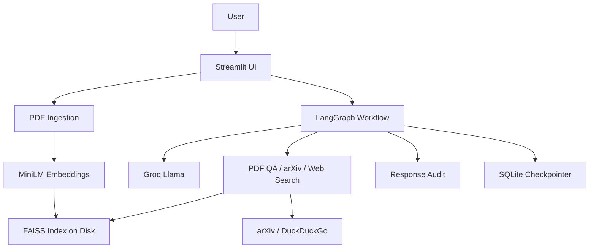

# NeuroBot

NeuroBot is a compact research assistant for technical PDFs. It combines:
- Streamlit for a usable chat interface
- LangGraph for multi-step orchestration
- Groq-hosted Llama for answer generation
- local MiniLM embeddings + FAISS for document retrieval
- local MCP servers for tool execution
- arXiv search and web fallback when local context is weak

The goal of this version is simple: make the project genuinely strong and interview-safe without turning it into a bloated pseudo-enterprise codebase.

## What It Does
- upload a PDF and chat with it
- search arXiv for related papers
- download an arXiv paper into the current session
- recover with web search when document context is not enough
- persist document indices locally so uploads survive a restart
- optionally attach a lightweight grounded response audit

## Why This Repo Is Better Now
- claims in the UI and docs are aligned with the actual implementation
- uploaded document knowledge is persisted under `runtime/`
- prompt and file validation are explicit
- the graph includes a real recovery branch instead of only describing one
- session stats in the sidebar reflect actual state
- dependency ranges are constrained for repeatable installs
- a small FastAPI backend is included for API-driven usage
- a benchmark corpus is included for offline checking
- tenant IDs namespace runtime artifacts and checkpoints
- optional MCP server integration is available for external tool execution
- all primary tools now call the local MCP server by default

## Architecture


## Project Structure
```text
neurobot-conversational-ai/
├── api/
│   └── main.py
├── app.py
├── data/benchmark/mini_benchmark.jsonl
├── docs/
│   ├── architecture/
│   ├── analysis/
│   └── project/
├── Makefile
├── scripts/run_benchmark.py
├── src/
│   ├── neurobot_db.py
│   ├── neurobot_benchmark.py
│   ├── neurobot_eval.py
│   ├── neurobot_graph.py
│   ├── neurobot_logging.py
│   ├── neurobot_mcp.py
│   ├── neurobot_mcp_server.py
│   ├── neurobot_tool_impl.py
│   ├── neurobot_service.py
│   ├── neurobot_rag.py
│   ├── neurobot_settings.py
│   ├── neurobot_tools.py
│   └── neurobot_validation.py
├── tests/
├── requirements.txt
└── render.yaml
```

## Quick Start
```bash
git clone https://github.com/Ashutosh-AIBOT/neurobot-conversational-ai.git
cd neurobot-conversational-ai

python -m venv .venv
source .venv/bin/activate
pip install -r requirements.txt

cp .env.example .env
make streamlit
```

The app starts the local MCP server automatically by default, so you do not need to preconfigure an external MCP host just to run the project locally.

## Common Commands
```bash
make install
make streamlit
make api
make benchmark
make benchmark-live
make compile
```

## Docs
- Project overview: `docs/project/PROJECT_OVERVIEW.md`
- System design: `docs/architecture/SYSTEM_DESIGN.md`
- Analysis artifacts: `docs/analysis/`

## Environment Variables
```bash
GROQ_API_KEY=
LANGCHAIN_API_KEY=
MODEL_NAME=llama-3.3-70b-versatile
MODEL_TEMPERATURE=0.1
APP_ENV=development
MAX_PDF_SIZE_MB=15
MAX_PROMPT_CHARS=4000
AUTO_EVAL_RESPONSES=true
MCP_SERVERS_JSON={}
```

## Optional MCP Integration
You can enable real MCP tool execution by configuring one or more stdio MCP servers in `MCP_SERVERS_JSON`.

Example:
```bash
MCP_SERVERS_JSON={
  "filesystem": {
    "command": "npx",
    "args": ["-y", "@modelcontextprotocol/server-filesystem", "/absolute/path"],
    "env": {},
    "startup_timeout_seconds": 8,
    "tool_timeout_seconds": 20
  }
}
```

The built-in `mcp_tool_call` tool uses:
- `server_name` for the configured server key
- `method` for the remote MCP tool name
- `arguments` for the JSON payload passed to that tool

For the default local setup, the app launches `python -m src.neurobot_mcp_server` behind the scenes and calls that server for `duckduckgo_search`, `arxiv_search`, `download_and_talk_to_paper`, `pdf_qa_tool`, and `evaluate_response`.

## Interview Talking Points
- real LangGraph orchestration rather than a single prompt wrapper
- retrieval persistence instead of in-memory only indexing
- explicit trade-off between compact architecture and production scale
- honest evaluation language: response audit, not fake guaranteed accuracy
- MCP-backed tool execution instead of direct tool calls
- separate API service for non-UI integration
- multi-tenant namespacing without a large infrastructure layer
- benchmark dataset for repeatable offline checks
- optional MCP bridge for real external tool calls without hardcoding integrations

## Limits
- the backend API is intentionally small rather than a full platform service
- local persistence is good for a portfolio demo, not large-scale multi-tenant traffic
- response audits are helpful proxies, not a benchmark-backed truth system

Those limits are deliberate and explainable, which is much better than overclaiming.
