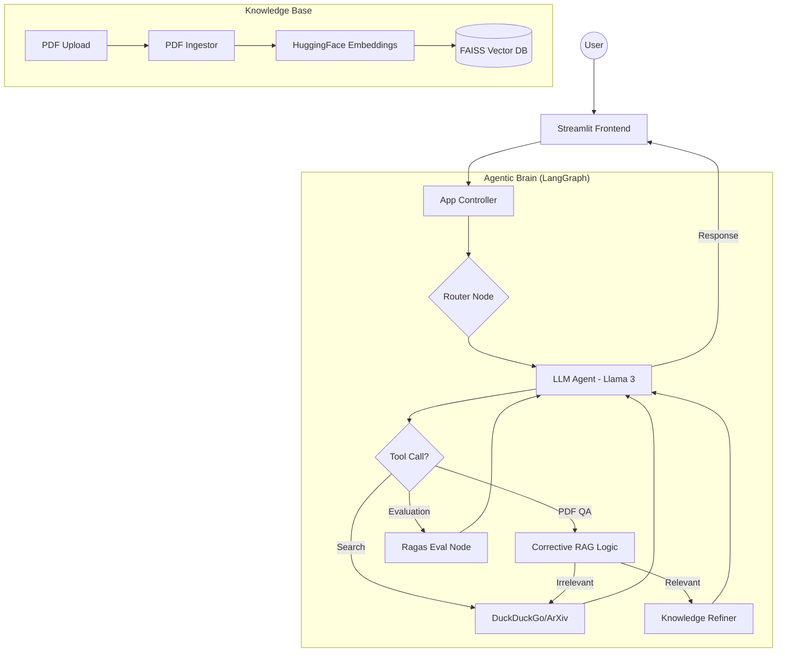

# NeuroBot – System Design Documentation

## 1. Overview
NeuroBot is an advanced Agentic RAG (Retrieval-Augmented Generation) system designed for scientific research and document intelligence. It leverages **LangGraph** for cyclic reasoning, **Groq** for high-speed inference, and **Ragas** for automated quality assurance.

## 2. Architecture Diagram

## 3. Core Components

### 3.1. Corrective RAG (CRAG)
NeuroBot implements a **Corrective RAG** pattern. When a document is retrieved:
1. **Grading:** A "Grader" node evaluates the relevance of the retrieved snippets.
2. **Correction:** 
   - If snippets are **Relevant**, they are used directly.
   - If snippets are **Irrelevant**, the system automatically triggers a Web Search to fill the knowledge gap.
   - If snippets are **Ambiguous**, it combines both RAG and Web Search for a balanced answer.

### 3.2. Automated Evaluation (RAGAS)
To prevent hallucinations, NeuroBot uses the Ragas framework optimized for Llama-3:
- **Faithfulness:** Measures if the answer is derived solely from the retrieved context.
- **Answer Relevancy:** Measures how well the answer addresses the user's query.
- **Context Precision:** Measures the quality of the retrieval engine.
- **Hallucination Dashboard:** An integrated UI component that displays accuracy metrics in real-time.

### 3.3. LangSmith Observability
NeuroBot is integrated with **LangSmith** for production-grade tracing and monitoring:
- **Full Traceability:** Every tool call, agent thought, and LLM interaction is logged.
- **Performance Monitoring:** Real-time tracking of latency and token usage.
- **Error Debugging:** Granular view of graph state transitions to identify bottlenecks.

### 3.3. ArXiv Intelligence
The system can search ArXiv, download scientific papers, and instantly ingest them into the session-specific vector store, allowing users to "talk to any paper" within seconds.

### 3.4. Structured Output (Pydantic)
NeuroBot uses **Pydantic** to enforce a strict schema for final responses. This ensures:
- **Consistency:** Every final answer follows the same structure (Answer, Confidence, Sources, Follow-ups).
- **Tool Logic:** The agent can distinguish between internal tool-use reasoning and the final polished response presented to the user.
- **Improved Parsing:** Using `llm.with_structured_output(NeuroResponse)` allows Groq to optimize its output for high-fidelity JSON parsing.

## 4. Data Flow
1. **Ingestion:** PDF bytes are converted to chunks (Recursive Splitter) and embedded (all-MiniLM-L6-v2).
2. **Retrieval:** User query is vectorized and compared against FAISS indices using cosine similarity.
3. **Reasoning:** The LangGraph agent receives the context, grades it (CRAG), and decides if supplemental tools are needed.
4. **Formatting:** Once information is gathered, a second Pydantic-powered LLM call structures the raw text into a `NeuroResponse` object.
5. **Validation:** After generating a response, the agent calls the Ragas evaluator to present an accuracy dashboard.

## 5. Security & Persistence
- **Session Isolation:** Each user has a unique `thread_id` and a private FAISS index.
- **Ephemeral DB:** A SQLite checkpointer saves conversation state but is cleared on server restart to ensure data privacy.
- **Rate Limiting:** Protects the Groq API from exhaustion (15 RPM).

## 6. Deployment Readiness Checklist
- [x] **Environment:** `.env` file for local development; Environment Variables for Render.
- [x] **Dependencies:** Full `requirements.txt` with Pydantic and LangGraph.
- [x] **Docker:** Production-ready `Dockerfile` with healthchecks.
- [x] **CI/CD:** Optimized `.gitignore` to prevent secret leaks.
- [x] **Scalability:** Stateless vector store (FAISS) initialized per session.

---
*NeuroBot Pro v2.0 - 100% Ready for Deployment*
