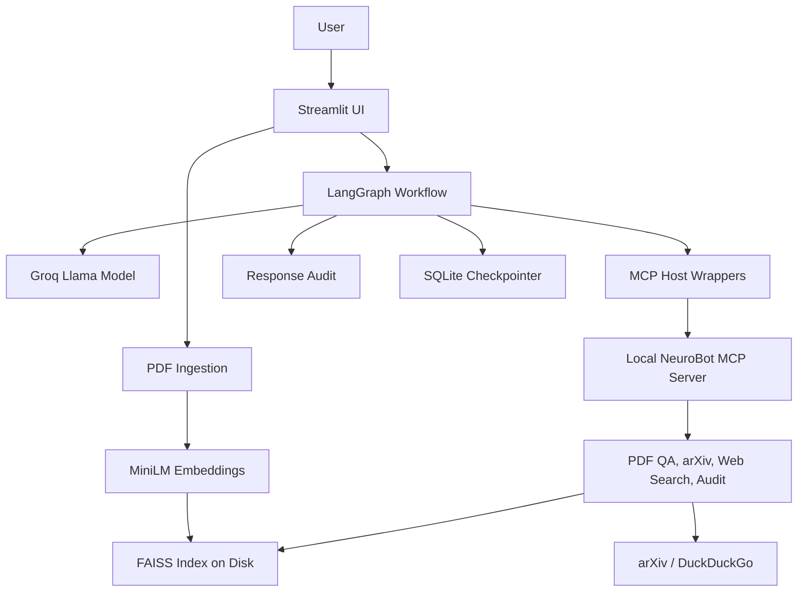

# NeuroBot System Design

## Overview
NeuroBot is a single-service RAG application built for portfolio-quality document intelligence. It is intentionally compact:
- Streamlit for the user interface
- LangGraph for orchestration
- Groq-hosted LLM for response generation
- local MiniLM embeddings + FAISS for retrieval
- optional grounded response audit when useful context exists
- MCP host/server split for tool execution

## Architecture

## LangGraph Flow
1. user message enters the graph
2. agent node decides whether to answer directly or use tools
3. tool node runs MCP-backed wrappers that call the local MCP server
4. grader node checks whether PDF context was relevant
5. if context is weak, a single web-recovery pass is triggered
6. structured output formats the final answer
7. optional response audit is attached when grounded context is available

## Why This Is Better Than the Original Version
- recovery logic is now a real branch, not just a claim in documentation
- uploaded knowledge is persisted locally under `runtime/`
- quality signals shown in the UI are real state values
- evaluation language is more honest: response audit, not guaranteed factual proof
- configuration and validation live in dedicated modules instead of being scattered
- a small FastAPI service exposes the core functionality outside the UI
- benchmark cases give you a repeatable offline evaluation starting point
- tenant namespaces prevent all sessions from sharing the same runtime artifacts
- tools are executed through a local MCP server by default, with the host keeping only the client-facing wrappers

## Known Boundaries
- the backend API is intentionally small rather than a full platform service
- this is not built for large-scale multi-tenant production traffic
- the response audit is a proxy signal, not a benchmark-backed truth system

Those limits are acceptable for a strong interview project as long as they are explained honestly.
